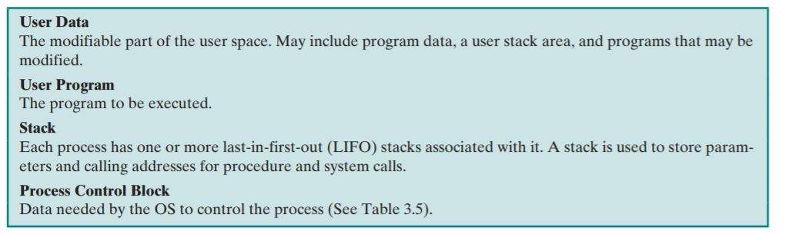
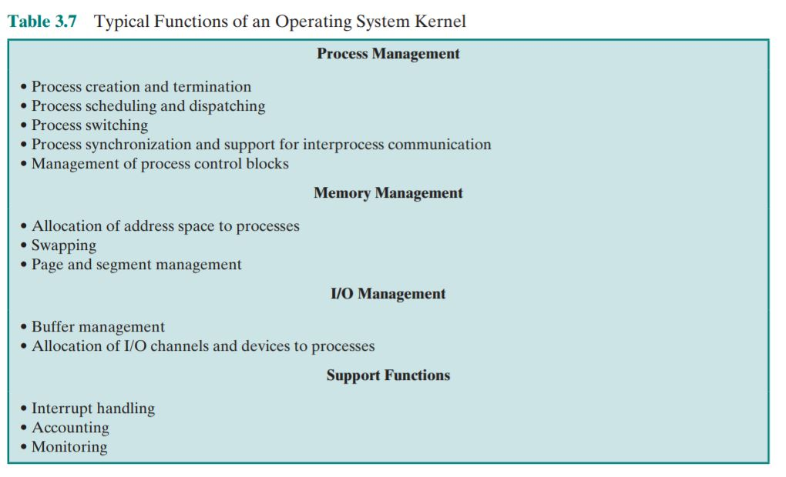
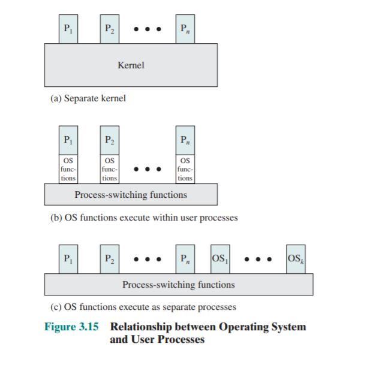
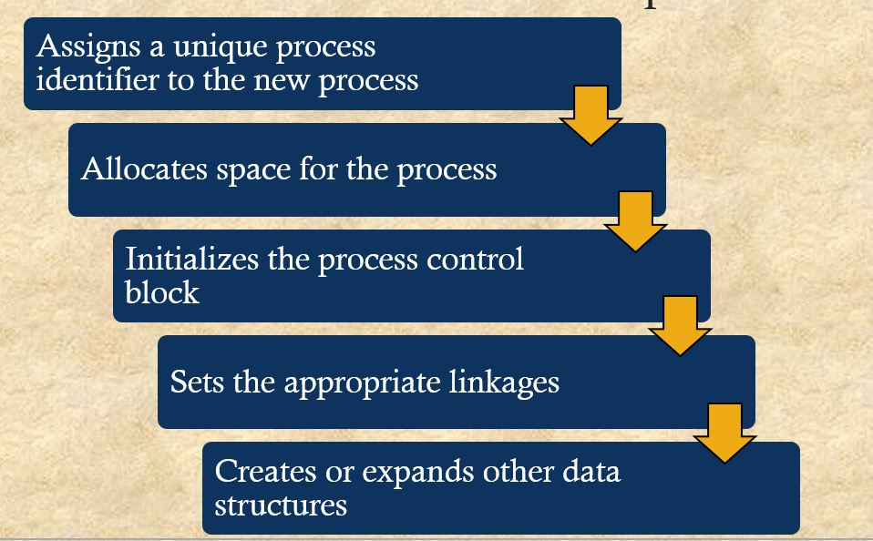
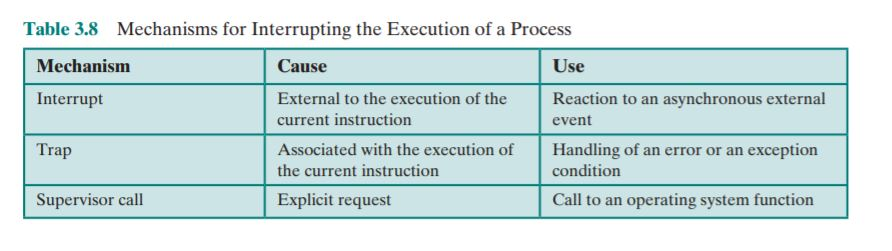
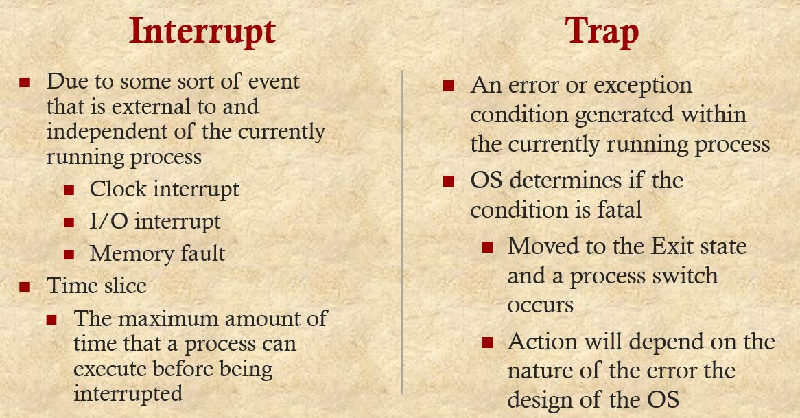

# Operating-Systems
 Operating Systems Internals and Design principles 8th 读书笔记，资源整理

<!--more-->

### 操作系统设计的三个目标：

- 便利性
- 有效性
- 扩展能力

### 操作系统运行时有哪两种模式：

- 作为硬件层与应用层之间的一个接口，也就是通常意义上硬件与软件之间的缓冲层。

- 作为资源管理器，管理计算机资源（IO，内存，等等）

  - Functions in the same way as ordinary computer software

  - Program, or suite of programs, executed by the processor

  - Frequently relinquishes control and must depend on the processor to allow it to regain control


### 操作系统发展

- Serial Processing 串行处理

- Simple Batch Systems 简单批处理

- Multiprogrammed Batch Systems 多道批处理系统

- Time Sharing Systems 分时系统

  |                                          | Batch Multiprogramming | Time sharing                     |
  | ---------------------------------------- | ---------------------- | -------------------------------- |
  | principal objective                      | Maximize processor use | Minimize response time           |
  | Source of directives to operating system | Job control language   | commmands entered at the termial |

  


### 与串行处理相比，多道程序设计有哪些优势

基于cpu执行指令的速度远远超过了I/O设备的处理速度，在程序执行的整个生命周期中，大量的时间被浪费在了等待I/O操作上。


多道批处理系统通过一次将准备运行的多个job载入内存中，当一个正在执行中的job需要I/O时，可以转去执行另外一个job。这种近似于并发执行的方式大大提高了程序执行的速率。


此外，由于一次将准备运行的多个job载入内存，进一步需要内存管理，同时在多个job间进行切换也需要使用调度算法。

### 什么是进程

一个正在执行中程序的实例。


同时进程还包括了以下三个组件

- 可执行程序
- 与此可执行程序相关的数据（变量，缓冲，等）
- 程序状态/执行上下文 process state/ execution context 

### 操作系统是怎样使用进程的执行上下文的

进程上下文（The execution context/process state） 是操作系统管理和控制进程的内部数据。 execution context是与进程本身分开的，避免操作系统直接被进程所访问到。进程上下文包含了两部分信息，一部分是管理进程相关的信息，另外一部分是处理器执行进程所需要的信息。

### 列出并简要介绍五种操作系统中的内存管理功能

- 进程隔离 

  操作系统必须保证每个进程不会干扰到其他进程的内存空间

- 自送分配与管理 

  动态分配内存

- 模块化编程

- 保护与访问控制

- 永久存储

### 解释实地址和虚地址的区别

实地址就是物理地址，是程序在内存中的实际地址

虚拟地址是在虚拟内存中的地址

### 描述时间片轮转调度技术

为每个进程分配一定的时间片，通过环形队列

### 说明单内核与微内核之间区别

单内核架构（**monolithic kernel** ）会将OS所提供的大部分功能集中在内核实现，包括

- scheduling
- file system
- networking
- device drivers
- memory management

典型情况下，这个大内核是作为一个进程实现的，所有元素都共享相同的地址空间

微内核架构（microkernel architecture）仅仅将一些必要的功能放在内核中实现

- address spaces, interprocess
- communication (IPC)
- basic scheduling

其他的一些服务由进程来提供，运行在用户态。极大地提升了操作系统的可定制性，用户可以根据不同的场景和应用来定制一些模块使用。在分布式系统有很大优势。

### 什么是多线程

多线程（**Multithreading**）是可以将一个进程分成许多线程，然后并发运行这些线程


• **Thread:** A dispatchable unit of work. It includes a processor context (which

includes the program counter and stack pointer) and its own data area for a

stack (to enable subroutine branching). A thread executes sequentially and is

interruptible so that the processor can turn to another thread.


• **Process :** A collection of one or more threads and associated system resources

(such as memory containing both code and data, open files, and devices). This

corresponds closely to the concept of a program in execution. By breaking

a single application into multiple threads, the programmer has great control

over the modularity of the application and the timing of application-related

events.


多线程技术面对的是同时运行许多互相独立的应用的场景。典型的例子如数据库。


## 进程描述与控制

### 什么是进程的轨迹（trace）

将单个进程的执行抽象为一系列的二进制的指令，这样我们就可以直观地从地址的变化上观察程序的执行。


### 基于下图简单描述五个状态


- running 进程正在被执行

- Ready 进程已经准备好，将要被调度器执行

- Blocked 进程在某些事件执行完成之前都不能被执行.eg:等待I/O的完成

- New 进程刚刚被OS创建，还未加载入内存中

- 结束态 进程结束，所占用的系统资源被释放

  

### 五个状态之间的相互转换

- null -> new 一个新的进程被创建


  

- new-> Ready 当OS准备一个新进程的执行命令时，它会将相应的进程从new转换为ready

- Ready-> Running: 处理器处于空闲状态时，调度器选择一个Ready状态的进程去运行

- Running->exit: 当进程结束或者时被OS撤销时，进入exit。通常来说可能因为以下原因进入到exit状态

  

- Running->ready

  进程由于耗尽时间片（Time slice）而进入ready状态，通常由于优先级高于此进程的其他进程抢占此进程的执行权，致使其进入ready状态

  Time slice：The period of time for which a process is allowed to run in a preemptive multitasking system is generally called the *time slice* or *quantum*. The scheduler is run once every time slice to choose the next process to run. The length of each time slice can be critical to balancing system performance vs process responsiveness - if the time slice is too short then the scheduler will consume too much processing time, but if the time slice is too long, processes will take longer to respond to input.

- Running->Blocked

  在执行过程中由于进程本身发出请求，等待回应而不得不暂时中断执行。最常见的情况是此进程在执行过程中发出了I/O请求，在前面提到过，I/O请求的时间远远超过了cpu的执行时间，如果CPU原地等待中断执行完成的话，时间上会造成极大的浪费。

- Blocked-> Ready 

  进程所等待的事件出现

### 抢占一个进程意味着什么

假设A为一个正在运行的进程，B为优先级高于A，处于Blocked的状态。在A正在运行的时候，B所等待的事件到达。调度器中断A的执行，转而去执行B。这就意味着进程B抢占了进程A。

### 进程繁殖

一个进程在执行中创建了新的子进程。

### 为什么下图有两个阻塞态


- suspend的出现

  考虑一个没有虚拟内存支持的系统，状态数目如上面的5状态图中，不存在suspend状态。那么所有running 和blocked 的状态都会被全部载入内存中。内存空间的容量会大大限制并发的进程数量，降低系统的运行速度

- CPU idle

  由于CPU的运行速率要比内存快上三个数量级，纵然内存载入许多进程，达到了所能容纳数量的上限，那么仍然会因为载入的所有进程都进入block状态，使得CPU闲置下来。

- 解决方案

  1. 增加内存容量 

     内存价格过于昂贵，且内存价格并不是随着容量线性增长，在后期一点点内存容量的提升都会引起价格的大幅度上涨。

  2. 虚拟存储技术（swapping）

     将进程的一部分或者是整个进程从内存交换到硬盘。当系统中所有进程都进入blocked状态，OS将其中一个进程标记为suspend状态并内存将它交换到磁盘，同时内存有新的空间来调度新的进程。

- 增加一个新的block状态，命名为suspend。考虑到进程是否等待某个事件（是否阻塞）与进程是否被换出内存（是否挂起），那么互相组合之后就会有4种新的状态，自然也就新增加了两个阻塞态

  - blocked suspended
  - blocked unsuspended
  - unblocked unsuspended
  - unblocked suspended
### 列出挂起进程的四个状态

- 进程不能被立即调入执行

- 进程可能在等待事件发生

- 进程可以被它的父进程，OS，或者自己置为挂起态

- 挂起状态不能被移除，只有等到收到将此进程挂起的实体的信号才可以解除挂起

下面是挂起的原因


### 操作系统维护哪些状态表来对哪些类型的实体进行管理

- Memory Tables 记录物理内存与虚拟内存的使用状态
- I/O tables   管理I/O 设备
- file tables 
- process tables


### 进程镜像由哪些元素组成

进程相关联的程序，数据，堆栈，以及属性参数构成进程镜像



```undefined
{% asset_img 3.10.JPG process mirrors % }
```

### 进程控制块中存放的信息

- Identifies
- process state information
- process control information
  

### 为什么需要两种模式（user mode/kernel mode）

为了保护操作系统，防止用户直接执行一些权限较高的指令

内核模式所提供的一些功能



### 操作系统与用户进程的关联

- 独立内核
- 嵌套在用户进程中
- 基于进程的操作系统




### 操作系统创建新的进程有哪些步骤

- 为进程分配一个独一无二的标识符

- 为进程分配空间

- 初始化进程控制块

- 设置指针，为了方便通过链表操作加入到相应的ready 或者blocked的队列中

- 创建与扩充其他数据结构




### 基于进程的操作系统有哪些优点

- 设计更加模块化
- 各个模块之间的接口定义十分清晰
- 操作系统一些非核心功能可以很方便的以独立的进程运行，在多核系统或者多个计算机组成的集群中有明显优势


### 中断与异常有哪些区别

系统中断可以分为中断（interrupt）与异常（trap）

中断由外部事件（I/O）所引起，与正在进行的程序是异步的。

异常是程序本身在运行过程中发生了错误，OS会根据错误的严重程度采取将此进程转入exit状态，或者修复错误后继续执行，或者仅仅是通知用户。





### 举出三个中断的例子

- 时钟中断

- I/O中断

- 内存错误 进程访问了受保护的内存区域

- 时间片耗尽

  

### 模式切换与进程切换有哪些区别

模式切换（mode switching）

- 无中断

  进入取指阶段，取出下一条将要被执行的指令

- 存在中断

  将程序计数器（program counter）设置为中断程序入口

  从用户模式切换到内核模式，开始执行中断程序

进程切换（process switching）

- 保存当前进程上下文
- 改变当前正在运行的进程的进程控制块的内容。举例来说，当进程切换开始，当前进程running的状态势必因为切换而发生改变。
- 将当前进程的控制块转移到队列中（blocking queue,ready queue）
- 选择另外一个进程开始执行
- 更新此进程的PCB
- 更新内存管理模块的数据结构
- 恢复被选中的进程上下文


